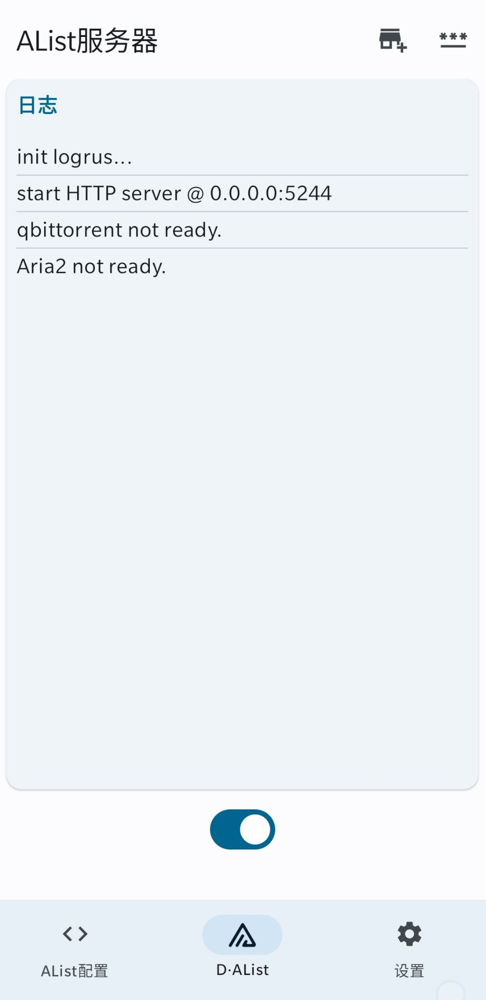

# AlistAndroid 

# Download

- [Github Actions (DEV)](https://github.com/jing332/AlistAndroid/actions)

> 分为两个版本
>
> LatestCommit: AList的[最新提交版](https://github.com/alist-org/alist) Github
> Actions会自动构建最新的AList代码，但是不保证稳定性
>
> LatestRelease: AList的[最新发布版](https://github.com/alist-org/alist/releases/latest) Github
> Actions会自动构建最新的AList发布版，保证稳定性。

---